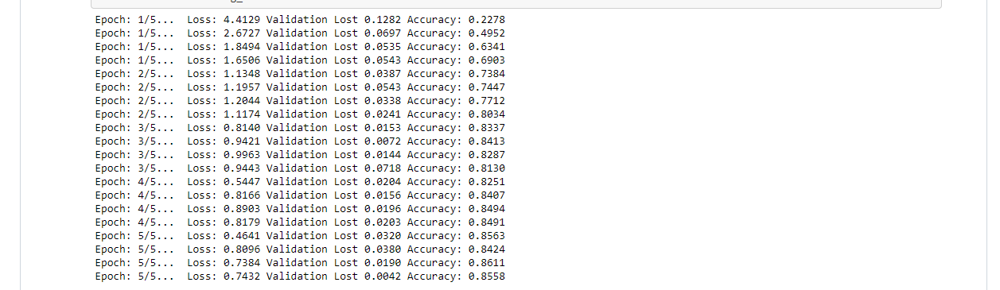

# Udacity image classifier
________________________________________
* Flowers version

## Last project from "AI Programming with Python Nanodegree"

#### The objective: Implement an image classification application, training a deep learning model on a dataset of flower images the use the trained model to classify images.

##### First, it will be written in a Jupyter notebook for training and testing, later the app will be written in pure python. Executed by command line.

### How to:
	#### Open the file "Image Classifier Project.ipynb" on your Jupyter Notebook.
	#### Or run the files trayn.py and predict.py as shown below.

### Execution:

## Jupyter Notebook:
 *Image Classifier Project.ipynb

 >>The project is broken down into multiple steps:

>>> Load and preprocess the image dataset

>>> Train the image classifier on your dataset

>> Use the trained classifier to predict image content

## Training and prediction:
 *trayn.py and predict.py
 ### Train a new network on a data set with train.py
  > #### Basic usage: python train.py data_directory
  > #### Prints out training loss, validation loss, and validation accuracy as the network trains
  > #### Options:
  >> ##### Set directory to save checkpoints: python train.py data_dir --save_dir save_directory
  >> ##### Choose architecture: python train.py data_dir --arch "vgg13"
  >> ##### Set hyperparameters: python train.py data_dir --learning_rate 0.01 --hidden_units 512 --epochs 20
  >> ##### Use GPU for training: python train.py data_dir --gpu

 ### Predict flower name from an image with predict.py along with the probability of that name. That is, you'll pass in a single image /path/to/image and return the flower name and class probability.
 > #### Basic usage: python predict.py /path/to/image checkpoint
 > #### Options:
 >> ##### Return top KK most likely classes: python predict.py input checkpoint --top_k 3
 >> ##### Use a mapping of categories to real names: python predict.py input checkpoint --category_names cat_to_name.json
 >> ##### Use GPU for inference: python predict.py input checkpoint --gpu
__________________________________________

### References:
> Torch py:
>> #### https://pytorch.org/tutorials/beginner/basics/buildmodel_tutorial.html
>> #### http://pytorch.org/docs/0.3.0/torchvision/index.html
>> #### https://pytorch.org/docs/0.3.0/torchvision/models.html#id2
>> #### https://pytorch.org/docs/0.3.0/torchvision/datasets.html
>> #### https://pytorch.org/tutorials/beginner/blitz/cifar10_tutorial.html
>> #### https://github.com/pytorch/examples/blob/master/imagenet/main.py
>> #### https://pytorch.org/tutorials/beginner/blitz/cifar10_tutorial.html#training-on-gpu

#### Udacity and peer repos:
> Reference list:
>> #### udacity (https://github.com/udacity/aipnd-project)
>> #### WittmannF (https://github.com/WittmannF/udacity-image-classifier)
>> #### mishraishan31 (https://github.com/mishraishan31/Image-Classifier)
>> #### mudigosa (https://github.com/mudigosa/Image-Classifier)
>> #### S-Tabor (https://github.com/S-Tabor/udacity-image-classifier-project)

##### Other sources:
> ##### PluralSight (https://www.pluralsight.com/guides/image-classification-with-pytorch)
> ##### Stackoverflow (https://pt.stackoverflow.com/)
> ##### towardsdatascience (https://towardsdatascience.com/how-to-train-an-image-classifier-in-pytorch-and-use-it-to-perform-basic-inference-on-single-images-99465a1e9bf5)
